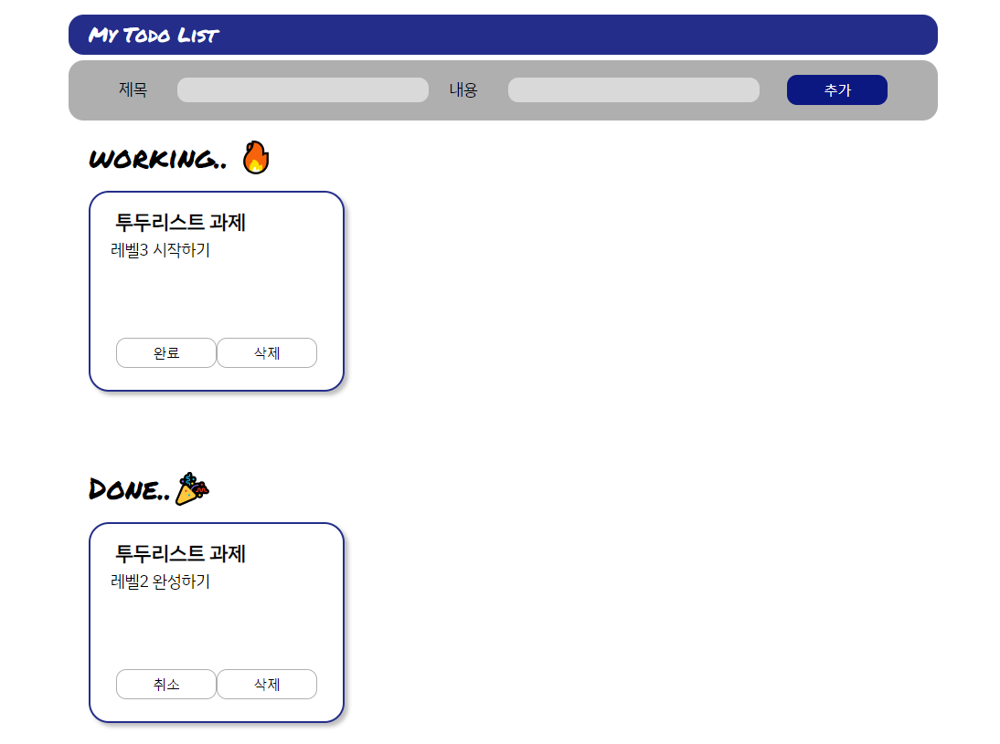

## TODO LIST (ver. level2: RTK)

### 투두리스트 작성 페이지

 

### 실행환경

- react-app
- yarn
- 크롬 브라우저 환경

### Files

📦src  
┣ 📂components  
┃ ┣ 📜TodoInput.tsx  
┃ ┣ 📜TodoItem.tsx  
┃ ┗ 📜TodoList.tsx  
┣ 📂redux  
┃ ┣ 📂config  
┃ ┃ ┗ 📜configStore.ts  
┃ ┗ 📂modules  
┃ ┃ ┗ 📜todoSlice.ts  
┣ 📂shared  
┃ ┗ 📜Layout.tsx  
┣ 📂stores  
┃ ┗ 📜todos.js  
┣ 📂styles  
┃ ┗ 📜GlobalStyle.tsx  
┣ 📜App.tsx  
┣ 📜hooks.ts  
┗ 📜index.tsx  
